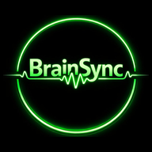

# BrainSync

**Multimodal neural entrainment tool**

Photic flicker + AM-modulated noise + binaural beats — configurable, offline-capable PWA.



## Features

- **Photic flicker** at any frequency 1–40 Hz via `requestAnimationFrame`
- **Noise types:** white, pink (−3 dB/oct), brown (−6 dB/oct)
- **AM modulation** of noise at the selected frequency (adjustable depth)
- **Binaural beats** — carrier 200 Hz left / 200+f Hz right, synchronized with AM and flicker
- **Flicker colors:** white, amber (reduced blue light), red (minimal blue light)
- **Presets:** δ 4 Hz · θ 8 Hz · α 10 Hz · β 20 Hz · γ 40 Hz
- Runs entirely in the browser — no server, no backend, no dependencies
- Installable as PWA (iOS Safari: Share → Add to Home Screen)

## Usage

### Via GitHub Pages (recommended)

Open `https://YOUR_USERNAME.github.io/brainsync/brainsync.html` in Safari or Chrome.

On iOS: **Share → Add to Home Screen** to install as a standalone app.

### Local (via a-Shell on iPhone)

```bash
cd ~/Documents
python -c "import http.server,socketserver; socketserver.TCPServer.allow_reuse_address=True; socketserver.TCPServer(('',8080),http.server.SimpleHTTPRequestHandler).serve_forever()"
```

Then open `http://localhost:8080/brainsync.html` in Chrome.

## ⚠️ Safety

**Photosensitive epilepsy:** do not use the flicker feature if you or family members have epilepsy or seizure history.

Discontinue if you experience discomfort, dizziness, or nausea.

Binaural mode requires headphones. Use in a dim environment.

## Files

| File | Description |
|------|-------------|
| `brainsync.html` | Main application |
| `manifest.json` | PWA manifest |
| `sw.js` | Service Worker (offline cache) |
| `icon-192.png` | App icon 192×192 |
| `icon-512.png` | App icon 512×512 |

## License

MIT — personal and clinical use permitted.

---
